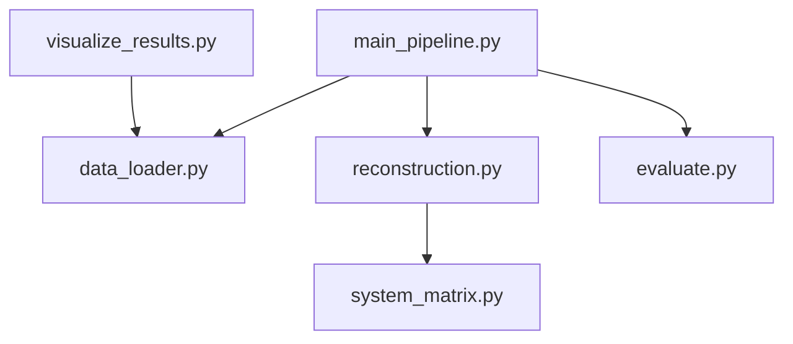

# SPECT 图像重建大作业

## 项目概述
本项目实现了基于 OSEM (Ordered Subsets Expectation Maximization) 算法的 SPECT 图像重建管线。项目包含从原始投影数据加载、系统矩阵建模、迭代重建、后处理滤波到最终图像质量评估的全套流程。

**主要功能：**
- **数据加载**：支持读取二进制投影数据 (`.dat`) 和 Excel 轨道参数 (`.xlsx`)。
- **系统建模**：实现了基于射线驱动（Ray-driven）的几何投影系统矩阵计算。
- **图像重建**：实现了 OSEM 算法，支持自定义子集数和迭代次数。
- **后处理**：提供三维高斯滤波功能以抑制噪声。
- **评估分析**：自动计算 RMSE 和 SSIM 指标，并生成对比图表。
- **报告生成**：自动生成 PDF 和 Word 格式的详细实验报告。

## 安装指南

### 前置要求
- Python 3.8 或更高版本

### 安装步骤
1. 克隆或下载本项目到本地目录。
2. 打开终端，进入项目根目录。
3. 创建并激活虚拟环境（可选但推荐）：
   ```bash
   python -m venv venv
   # Windows:
   .\venv\Scripts\activate
   # Linux/Mac:
   source venv/bin/activate
   ```
4. 安装依赖：
   ```bash
   pip install -r requirements.txt
   ```

## 运行指南

### 一键运行
执行主程序即可完成从重建到评估的全流程：
```bash
python main_pipeline.py
```
程序运行完成后，将生成以下文件：
- `MyRecon.dat`: 原始重建结果
- `MyFiltered.dat`: 滤波后结果
- `evaluation_results.txt`: 评估指标文本

### 可视化
生成切片对比图和正交视图：
```bash
.\venv\Scripts\python.exe visualize_results.py
```
图片将保存在 `pictures/` 目录下。

### 生成报告
生成最终的 PDF 和 Word 实验报告：
```bash
.\venv\Scripts\python.exe generate_refined_report.py
```
报告将保存在 `reports/` 目录下。

## 代码结构说明

| 文件名 | 功能描述 |
| :--- | :--- |
| **main_pipeline.py** | **主入口程序**。串联数据加载、重建、滤波和评估流程。 |
| **data_loader.py** | **数据加载模块**。负责读取二进制数据和 Excel 文件。 |
| **system_matrix.py** | **系统矩阵模块**。计算基于几何投影的稀疏系统矩阵。 |
| **reconstruction.py** | **重建核心模块**。实现 OSEM 迭代算法。 |
| **evaluate.py** | **评估模块**。计算 RMSE, SSIM 指标及执行高斯滤波。 |
| **visualize_results.py** | **可视化脚本**。生成重建结果的切片对比图。 |
| `generate_refined_report.py` | 报告生成脚本。自动汇总结果生成 PDF/DOCX。 |
| `requirements.txt` | 项目依赖列表。 |

### 模块调用关系


## 配置选项
目前主要参数在代码中配置，常见参数如下：

- **重建参数** (`main_pipeline.py`):
  - `n_subsets`: 子集数目 (默认: 4)
  - `n_iterations`: 迭代次数 (默认: 10)

- **系统矩阵参数** (`system_matrix.py`):
  - `image_size`: 图像尺寸 (默认: 128)
  - `pixel_size`: 像素大小 (默认: 3.3 mm)

- **滤波参数** (`evaluate.py`):
  - `fwhm_mm`: 高斯滤波半高宽 (默认: 10.0 mm)

## 常见问题解答 (FAQ)

**Q1: 运行速度慢怎么办？**
A: 系统矩阵计算较为耗时，但仅需在第一次运行时计算（目前代码为每次计算，可优化为缓存）。OSEM 重建速度取决于迭代次数，可适当减少迭代次数进行快速测试。

**Q2: 如何查看 .dat 文件？**
A: 请使用 Amide 软件导入。导入参数为：Raw Data, Float32, Little Endian, Dim: 128x128x128, Voxel Size: 3.3mm。

**Q3: 缺少字体导致报告生成失败？**
A: 报告生成脚本默认尝试使用 Windows 系统自带的中文字体（SimHei/SimSun）。如在非 Windows 环境运行，请修改 `generate_refined_report.py` 中的字体路径。
