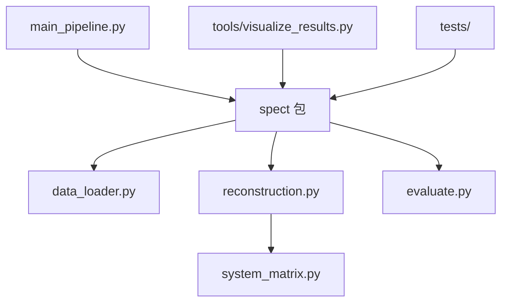

# SPECT 图像重建大作业

## 项目概述
本项目实现了基于 OSEM (Ordered Subsets Expectation Maximization) 算法的 SPECT 图像重建管线。项目包含从原始投影数据加载、系统矩阵建模、迭代重建、后处理滤波到最终图像质量评估的全套流程。

**主要功能：**
- **数据加载**：支持读取二进制投影数据 (`.dat`) 和 Excel 轨道参数 (`.xlsx`)。
- **系统建模**：实现了基于射线驱动（Ray-driven）的几何投影系统矩阵计算。
- **图像重建**：实现了 OSEM 算法，支持自定义子集数和迭代次数。
- **后处理**：提供三维高斯滤波功能以抑制噪声。
- **评估分析**：自动计算 RMSE 和 SSIM 指标，并生成对比图表。
- **报告生成**：自动生成 PDF 和 Word 格式的详细实验报告。

## 安装指南

### 前置要求
- Python 3.8 或更高版本

### 安装步骤
1. 克隆或下载本项目到本地目录。
2. 打开终端，进入项目根目录。
3. **创建并激活虚拟环境（强烈推荐，确保项目环境隔离）**：
   
   **macOS/Linux:**
   ```bash
   # 方式1: 使用自动设置脚本（推荐）
   ./scripts/setup_venv.sh
   
   # 方式2: 手动创建
   python3 -m venv .venv
   source .venv/bin/activate
   ```
   
   **Windows:**
   ```bash
   # 方式1: 使用批处理脚本（推荐）
   scripts\run_all.bat
   
   # 方式2: 手动创建
   python -m venv venv
   .\venv\Scripts\activate
   ```
   
   > **重要提示**: 使用虚拟环境可以确保本项目依赖不会影响其他 Python 项目，也不会被其他项目的依赖影响。

4. 安装依赖（如果使用手动方式）：
   ```bash
   pip install -r requirements.txt
   ```

### 自动激活虚拟环境

项目已配置自动激活虚拟环境功能，打开项目时会自动激活：

- **VS Code/Cursor**：已自动配置（`.vscode/settings.json`），打开项目后集成终端会自动激活虚拟环境
- **终端用户（direnv）**：项目包含 `.envrc` 配置文件，使用 `direnv` 可实现自动激活（详见 `docs/自动激活虚拟环境指南.md`）
- **手动激活**：运行 `source scripts/activate.sh` 或 `source .venv/bin/activate`

> **提示**：首次使用 `direnv` 需要运行 `direnv allow` 允许 `.envrc` 文件执行。

详细说明请查看：[自动激活虚拟环境指南.md](docs/自动激活虚拟环境指南.md)

## 运行指南

### 一键运行
执行主程序即可完成从重建到评估的全流程：
```bash
python main_pipeline.py
```
程序运行完成后，将生成以下文件（保存在 `outputs/` 目录）：
- `outputs/MyRecon.dat`: 原始重建结果
- `outputs/MyFiltered.dat`: 滤波后结果
- `outputs/evaluation_results.txt`: 评估指标文本

### 可视化
生成切片对比图和正交视图：
```bash
# macOS/Linux (确保虚拟环境已激活)
python tools/visualize_results.py

# Windows
.\venv\Scripts\python.exe tools\visualize_results.py
```
图片将保存在 `pictures/` 目录下。

### 生成报告
生成最终的 PDF 和 Word 实验报告：
```bash
# macOS/Linux (确保虚拟环境已激活)
python scripts/generate_refined_report.py

# Windows
.\venv\Scripts\python.exe scripts\generate_refined_report.py
```
报告将保存在 `reports/` 目录下。

## 项目结构

```
SPECT/
├── README.md                 # 项目主文档
├── requirements.txt          # Python 依赖列表
├── main_pipeline.py          # 主程序入口
│
├── spect/                    # 📦 核心模块包
│   ├── __init__.py           # 包初始化
│   ├── data_loader.py        # 数据加载模块
│   ├── system_matrix.py      # 系统矩阵模块
│   ├── reconstruction.py     # OSEM 重建算法
│   └── evaluate.py           # 评估和滤波模块
│
├── data/                     # 📊 数据目录
│   ├── input/                # 输入数据
│   │   ├── Proj.dat          # 投影数据
│   │   └── orbit.xlsx       # 轨道参数
│   └── reference/            # 参考数据
│       ├── OSEMReconed.dat   # 参考重建结果
│       └── Filtered.dat      # 参考滤波结果
│
├── outputs/                  # 📤 输出目录（程序生成）
│   ├── MyRecon.dat           # 重建结果
│   ├── MyFiltered.dat        # 滤波结果
│   └── evaluation_results.txt # 评估指标
│
├── tools/                    # 🔧 工具脚本
│   ├── visualize_results.py  # 可视化脚本
│   ├── inspect_data.py       # 数据检查工具
│   └── extract_pptx.py      # PPTX 提取工具
│
├── scripts/                  # 📜 脚本目录
│   ├── setup_venv.sh         # 虚拟环境设置
│   ├── activate.sh           # 手动激活脚本
│   ├── generate_*.py         # 报告生成脚本
│   └── check_paths.py        # 路径检查脚本
│
├── tests/                    # 🧪 测试目录
│   ├── __init__.py           # 测试模块初始化
│   ├── test_data_loader.py   # 数据加载测试
│   ├── test_system_matrix.py # 系统矩阵测试
│   ├── test_reconstruction.py # 重建算法测试
│   ├── test_evaluate.py      # 评估模块测试
│   └── README.md             # 测试说明文档
│
├── pictures/                 # 🖼️ 图片输出目录
├── reports/                   # 📄 报告输出目录
├── materials/                # 📚 材料目录（不提交到 Git）
├── docs/                     # 📖 文档目录（不提交到 Git）
├── .envrc                    # direnv 配置文件
├── .gitignore                # Git 忽略规则
└── .vscode/                  # VS Code 配置（部分文件）
    └── settings.json          # Python 解释器配置
```

## 代码结构说明

| 文件/目录 | 功能描述 |
| :--- | :--- |
| **main_pipeline.py** | **主入口程序**。串联数据加载、重建、滤波和评估流程。 |
| **spect/** | **核心模块包**。包含所有核心功能模块，作为 Python 包组织。 |
| ├── `data_loader.py` | 数据加载模块。负责读取二进制数据和 Excel 文件。 |
| ├── `system_matrix.py` | 系统矩阵模块。计算基于几何投影的稀疏系统矩阵。 |
| ├── `reconstruction.py` | 重建核心模块。实现 OSEM 迭代算法。 |
| └── `evaluate.py` | 评估模块。计算 RMSE, SSIM 指标及执行高斯滤波。 |
| **tools/** | **工具脚本目录**。 |
| ├── `visualize_results.py` | 可视化脚本。生成重建结果的切片对比图。 |
| ├── `inspect_data.py` | 数据检查工具。 |
| └── `extract_pptx.py` | PPTX 提取工具。 |
| **scripts/** | **脚本目录**。 |
| ├── `setup_venv.sh` | 虚拟环境设置脚本。 |
| ├── `activate.sh` | 手动激活虚拟环境脚本。 |
| └── `generate_*.py` | 报告生成脚本。自动汇总结果生成 PDF/DOCX。 |
| **data/** | **数据目录**。 |
| ├── `input/` | 输入数据（原始投影数据和轨道参数）。 |
| └── `reference/` | 参考数据（标准答案，用于对比评估）。 |
| **outputs/** | **输出目录**。程序运行生成的所有输出文件。 |
| **tests/** | **测试目录**。包含项目的单元测试文件。 |
| `requirements.txt` | 项目依赖列表。 |

### 模块调用关系


### 使用核心模块

核心模块已组织为 Python 包，可以这样导入：

```python
from spect import SPECTDataLoader, OSEMReconstructor, Evaluator, SystemMatrix

# 或单独导入
from spect.data_loader import SPECTDataLoader
from spect.reconstruction import OSEMReconstructor
```

## 配置选项
目前主要参数在代码中配置，常见参数如下：

- **重建参数** (`main_pipeline.py`):
  - `n_subsets`: 子集数目 (默认: 4)
  - `n_iterations`: 迭代次数 (默认: 10)

- **系统矩阵参数** (`spect/system_matrix.py`):
  - `image_size`: 图像尺寸 (默认: 128)
  - `pixel_size`: 像素大小 (默认: 3.3 mm)

- **滤波参数** (`spect/evaluate.py`):
  - `fwhm_mm`: 高斯滤波半高宽 (默认: 10.0 mm)

## 数据文件说明

### 输入数据
- **`data/input/Proj.dat`**: 投影数据 (128×128×64, float32)
- **`data/input/orbit.xlsx`**: 轨道参数 (64 个角度)

### 参考数据
- **`data/reference/OSEMReconed.dat`**: 参考重建结果 (128×128×128)
- **`data/reference/Filtered.dat`**: 参考滤波结果 (128×128×128)

### 输出数据
程序运行后会在 `outputs/` 目录生成：
- `MyRecon.dat`: 重建结果
- `MyFiltered.dat`: 滤波结果
- `evaluation_results.txt`: 评估指标

## 运行测试

运行项目的单元测试：

```bash
# 运行所有测试
python -m unittest discover tests

# 运行单个测试
python -m unittest tests.test_data_loader
python tests/test_data_loader.py
```

## 常见问题解答 (FAQ)

**Q1: 运行速度慢怎么办？**
A: 系统矩阵计算较为耗时，但仅需在第一次运行时计算（目前代码为每次计算，可优化为缓存）。OSEM 重建速度取决于迭代次数，可适当减少迭代次数进行快速测试。

**Q2: 如何查看 .dat 文件？**
A: 请使用 Amide 软件导入。导入参数为：Raw Data, Float32, Little Endian, Dim: 128x128x128, Voxel Size: 3.3mm。

**Q3: 缺少字体导致报告生成失败？**
A: 报告生成脚本默认尝试使用 Windows 系统自带的中文字体（SimHei/SimSun）。如在非 Windows 环境运行，请修改 `scripts/generate_refined_report.py` 中的字体路径。

**Q4: 数据文件在哪里？**
A: 输入数据在 `data/input/` 目录，参考数据在 `data/reference/` 目录。程序运行后，输出文件会保存在 `outputs/` 目录。

**Q5: 如何查看项目结构？**
A: 项目已按功能模块组织，核心代码在 `spect/` 包中，工具脚本在 `tools/` 目录，测试文件在 `tests/` 目录。详细说明请查看项目结构部分。

## 开发说明

### 项目组织原则

- **核心模块** (`spect/`): 作为 Python 包组织，便于导入和重用
- **工具脚本** (`tools/`): 独立的工具脚本，可能需要访问核心模块
- **测试文件** (`tests/`): 单元测试，验证各模块功能
- **数据文件** (`data/`): 输入数据和参考数据分离管理
- **输出文件** (`outputs/`): 程序生成的文件，已添加到 `.gitignore`

### 路径检查

可以使用路径检查脚本验证所有路径是否正确：

```bash
python scripts/check_paths.py
```

## Git 版本控制

### 提交的文件

以下文件和目录会被提交到 Git：
- 核心代码：`spect/`, `main_pipeline.py`, `tools/`, `scripts/`
- 测试文件：`tests/`
- 输入数据：`data/input/`（投影数据和轨道参数）
- 参考数据：`data/reference/`（用于评估的参考结果）
- 配置文件：`requirements.txt`, `.gitignore`, `.envrc`, `.vscode/settings.json`
- 文档：`README.md`

### 不提交的文件

以下文件和目录不会被提交（已在 `.gitignore` 中配置）：
- 虚拟环境：`.venv/`, `venv/`, `env/`
- 输出文件：`outputs/`（程序运行生成的文件）
- 文档目录：`docs/`（内部文档）
- 材料目录：`materials/`（课程材料）
- 临时文件：`*.pyc`, `__pycache__/`, `*.tmp`, `*.log`
- 系统文件：`.DS_Store`, `.idea/`

> **注意**：`outputs/` 目录中的文件是程序运行后生成的，不应提交到版本控制。如果需要保存特定版本的结果，请使用其他方式（如标签或发布）。

## 许可证

本项目为课程作业项目。
